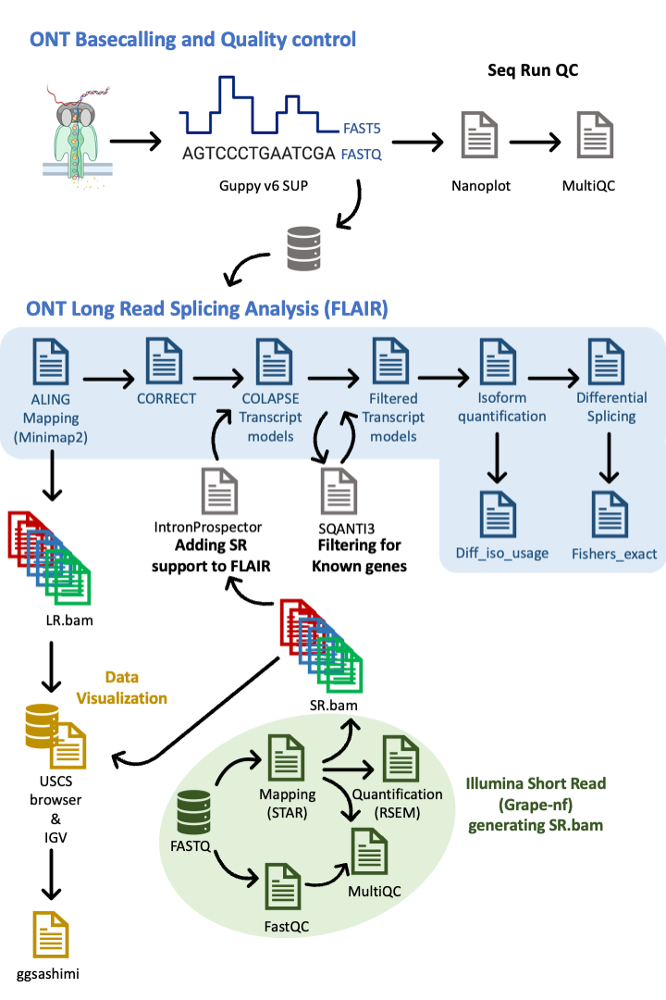

# TFM_SCarbonell_Analysis

## R-scripts:

- **PCA_scaled_centered.R**: Build scaled and centred PCAs for LRonly and SRsupported data.
- **Rscript_different_isoform_usage.R**: Perform different isoform usage analysis.
- **Splicing_events.R**: Analyze splicing events (IR, ES, Alt3, and Alt5).
- **Upset_plots_addingGENCODE.R**: Prepare upset plots of isoform counts and GENCODE for LRonly and SRsupported data.
- **PLOT_regression_plots_replicates.R**: Generate regression plots for LRonly and SRsupported data.

## Bash-scripts:

- **run.ggsashimi.sh**: Generate ggsashimi plots.
- **run.sqanti.filter.known.sh**: Filter known genes using SQANTI categories.
- **run.intronProspector.sh**: from BAM/SAM generates a list of splicing junctions (SJs)
